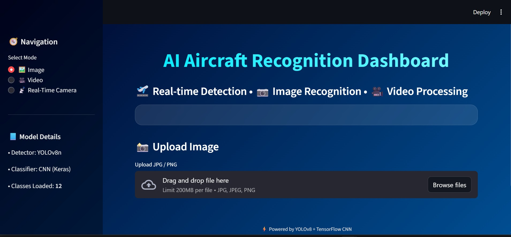
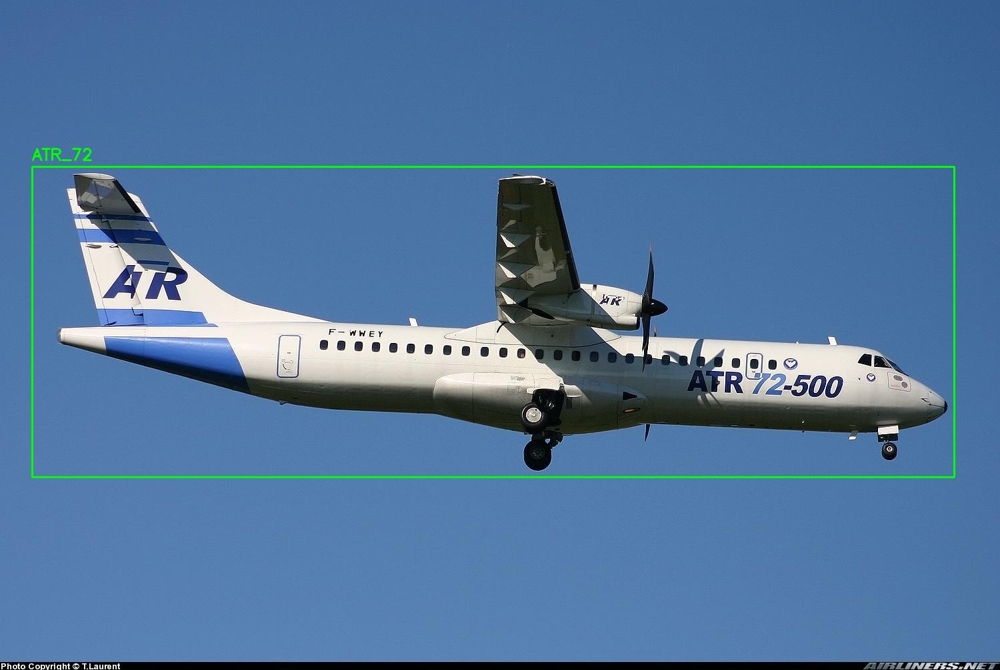
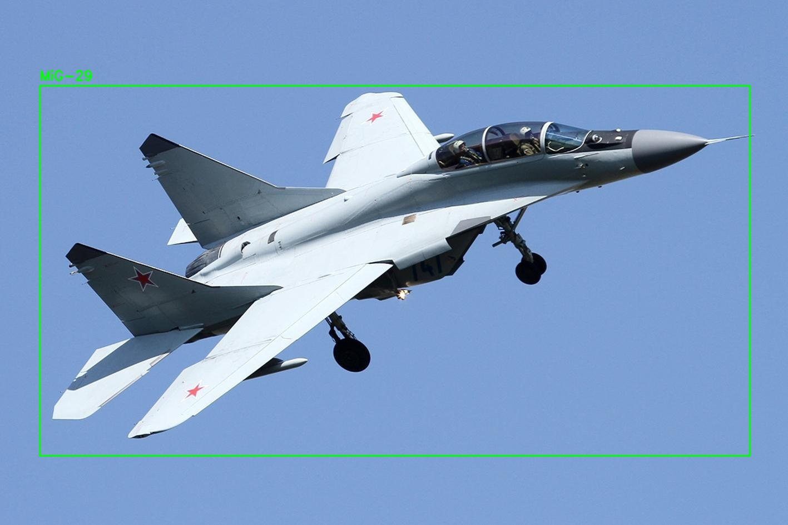
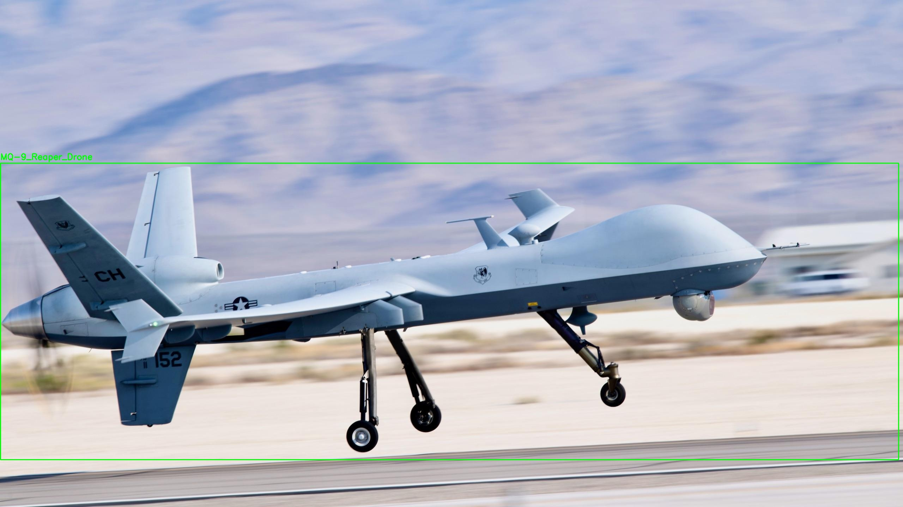
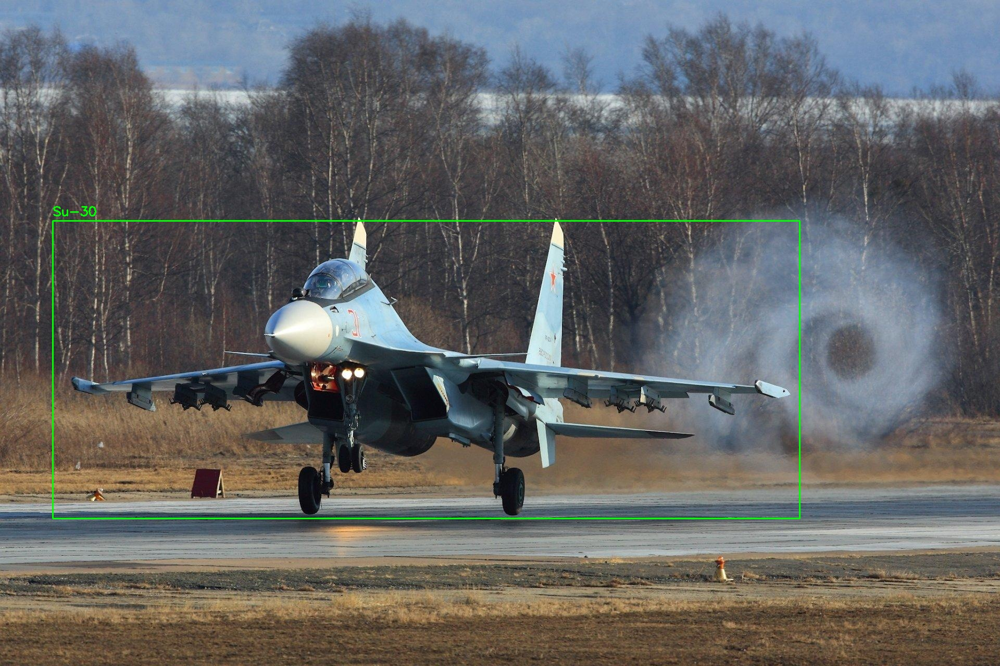

# ✈️ AI-Based Aircraft Recognition System

### Aircraft Detection using YOLOv8 and Classification using ResNet-50

An intelligent aircraft recognition system that detects and classifies aircraft from images, videos, and real-time webcam feeds using Deep Learning and Computer Vision techniques.

## 📌 Project Overview

This project combines:

* **YOLOv8** for real-time aircraft detection
* **ResNet-50** for aircraft classification

The system first detects aircraft using bounding boxes and then classifies the detected aircraft type with confidence scores.

### 🎯 Main Objectives

* Detect aircraft accurately in different environments
* Classify multiple aircraft categories
* Support real-time recognition
* Provide a user-friendly web interface

# 🖥️ Output Screenshots

## 🔹 Dashboard



## 🔹 Detection & Classification Results

### ATR-72 Aircraft



### MiG-29 Fighter Aircraft



### MQ-9 Reaper Drone



### Su-30 Aircraft



# 🚀 Features

* ✅ Aircraft Detection using YOLOv8
* ✅ Aircraft Classification using ResNet-50
* ✅ Real-Time Webcam Detection
* ✅ Image Detection Support
* ✅ Video Detection Support
* ✅ Flask-Based Web Interface
* ✅ Modular Detection + Classification Pipeline

# 🧠 Models Used

## 1️⃣ YOLOv8 – Detection Model

YOLOv8 is used for detecting aircraft in images and video streams.

### Functions:

* Detects aircraft location
* Draws bounding boxes
* Generates confidence scores
* Supports real-time performance

## 2️⃣ ResNet-50 – Classification Model

ResNet-50 is used to classify detected aircraft types.

### Functions:

* Transfer learning based CNN model
* High classification accuracy
* Handles fine-grained aircraft differences
* Efficient feature extraction

# 📂 Project Structure

```bash
AI-Based-AircraftRecognition-System/
│
├── app.py
├── scripts/
│   ├── train_detector.py
│   ├── train_classifier.py
│   ├── recognize_image.py
│   └── detect_video.py
│
├── models/
├── test_images/
├── requirements.txt
├── README.md
└── .gitignore
```

# 📊 Dataset Information

Datasets used in this project:

* FGVC-Aircraft Dataset
* FAIR1M Dataset
* UCAS-AOD Dataset
* Public aviation image sources

### Dataset Includes:

* Commercial Aircraft
* Military Aircraft
* UAV & Drone Images
* Different lighting and angle conditions

### Annotation Tool:

* LabelImg (YOLO Format)

# ⚙️ Installation

## 🔹 Clone Repository

```bash
git clone https://github.com/yourusername/AI-Based-AircraftRecognition-System.git
cd AI-Based-AircraftRecognition-System
```

## 🔹 Create Virtual Environment

```bash
python -m venv venv
```

### Activate Environment (Windows)

```bash
venv\Scripts\activate
```

## 🔹 Install Dependencies

```bash
pip install -r requirements.txt
```

# ▶️ Running the Project

## 🔹 Run Flask Web Application

```bash
python app.py
```

Open browser:

```bash
http://127.0.0.1:5000
```


## 🔹 Train YOLOv8 Detector

```bash
python scripts/train_detector.py
```

## 🔹 Train ResNet-50 Classifier

```bash
python scripts/train_classifier.py
```


## 🔹 Run Image Detection

```bash
python scripts/recognize_image.py
```


## 🔹 Run Video Detection

```bash
python scripts/detect_video.py
```

# 📈 Performance Metrics

The system performance was evaluated using:

* Accuracy
* Precision
* Recall
* F1-Score
* mAP (Mean Average Precision)

### Results:

* Accurate aircraft detection
* Reliable classification performance
* Real-time processing capability
* Good performance in complex backgrounds

# 💻 Technologies Used

* Python
* PyTorch
* YOLOv8
* OpenCV
* NumPy
* Flask
* Matplotlib

# 🔥 Advantages

* End-to-End Aircraft Recognition
* Real-Time Processing
* Scalable Architecture
* Modular Design
* Easy Deployment

# ⚠️ Limitations

* Small aircraft may reduce accuracy
* Similar aircraft types can create confusion
* Real-time performance depends on GPU hardware

# 🔮 Future Enhancements

* DeepSORT Aircraft Tracking
* Satellite Image Support
* Edge Device Deployment
* Explainable AI using Grad-CAM
* Expanded Aircraft Dataset

# 📌 Applications

* Airport Surveillance
* Airspace Monitoring
* Defense Systems
* UAV Monitoring
* Aviation Analytics

# 👨‍💻 Developed By

**Abhishek Ireddy**
Department of Computer Science and Engineering
BMS Institute of Technology & Management

---

# ⭐ Support

If you found this project useful, give it a ⭐ on GitHub!
